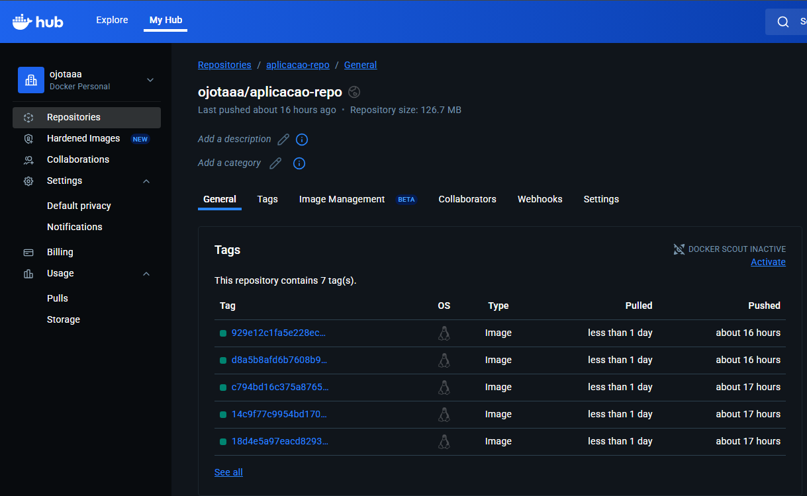

# - Projeto CI/CD: Aplicação FastAPI (aplicacao-repo)

Este repositório contém o código-fonte da aplicação FastAPI e a pipeline de Integração Contínua (CI).

O objetivo deste repositório é automatizar o *build* e a *publicação* da imagem Docker, além de atualizar o repositório de manifestos.

**Repositório de Manifestos (CD):** [`github.com/oJotaaa/manifestos-repo`](https://github.com/oJotaaa/manifestos-repo)

## Papel no Projeto: Integração Contínua (CI)

Este repositório é responsável pela **Integração Contínua**. A pipeline definida em `.github/workflows/ci-cd.yml` é acionada a cada `push` na branch `main` e executa os seguintes passos:

1. **Login no Docker Hub:** Autentica-se usando os segredos `DOCKER_USERNAME` e `DOCKER_PASSWORD`.
2.  **Build & Push:** Constrói a imagem Docker da aplicação (`main.py` + `Dockerfile`) e a publica no Docker Hub. A imagem é tagueada com o SHA do commit (ex: `oJotaaa/aplicacao-repo:a1b2c3d4e5f6`).
3. **Clone & Update Manifests:** Clona o `manifestos-repo` e usa o comando `sed` para substituir a tag da imagem no `deployment.yaml` pela nova tag (o SHA).
4. **Commit & Push Manifests:** Faz o *commit* e *push* da alteração no `deployment.yaml` para o `manifestos-repo`, usando a `SSH_PRIVATE_KEY`.

## 📦 Evidência de Build e Push no Docker Hub 

Abaixo está a evidência de que a pipeline publicou com sucesso as imagens tagueadas no Docker Hub após cada *push*.

## 📁 Estrutura de Arquivos

* **`main.py`**: Aplicação FastAPI simples que retorna "Hello World".
* **`Dockerfile`**: Receita para construir a imagem Docker da aplicação.
* **`requirements.txt`**: Dependências Python e servidor para aplicação.
* **`.github/workflows/ci-cd.yml`**: Arquivo de workflow do GitHub Actions.